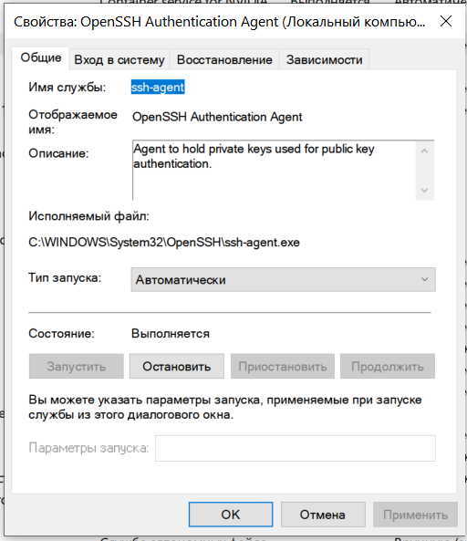

* SSH client on Windows, Linux and WSL

** Automatically start ssh-agent and add your keys in Windows Subsystem for Linux (WSL)
Add the following to the end of your ~/.bashrc file, start a new prompt and you’re done!
```sh
if [ -z "$SSH_AUTH_SOCK" ] ; then
    eval `ssh-agent -s`
    ssh-add
fi
```

** Automatically start ssh-agent on Windows
```
> Get-Service ssh-agent

Status   Name               DisplayName
------   ----               -----------
Stopped  ssh-agent          OpenSSH Authentication Agent

> Get-Service ssh-agent | Select StartType

StartType
---------
Disabled

> Get-Service -Name ssh-agent | Set-Service -StartupType Automatic
```


